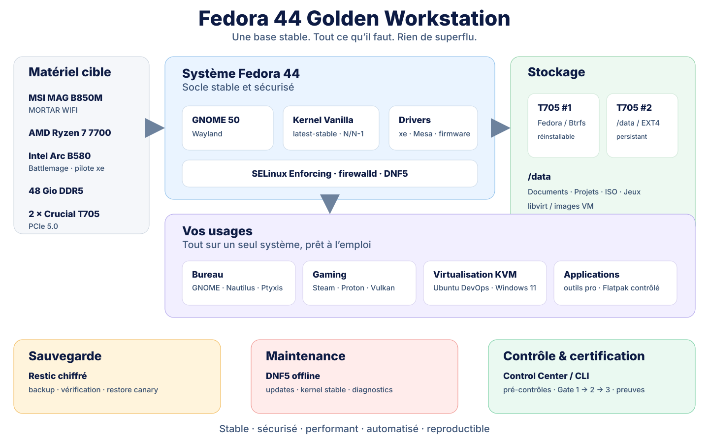
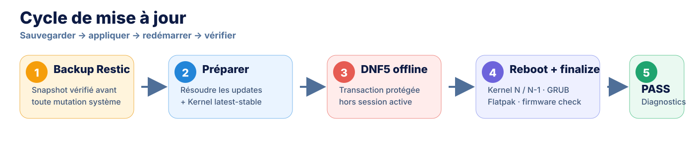
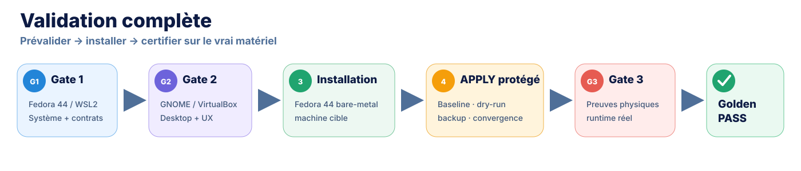

<div align="center">

# Fedora 44 Golden Workstation

**GNOME 50 · Ryzen 7 7700 · Intel Arc B580 · DevOps · Gaming · KVM**

[](https://github.com/mathiasseguincadiche/FEDORA_GNOME_CUSTOM/actions/workflows/tests.yml)
[](https://github.com/mathiasseguincadiche/FEDORA_GNOME_CUSTOM/actions/workflows/shell-quality.yml)
[](https://github.com/mathiasseguincadiche/FEDORA_GNOME_CUSTOM/actions/workflows/fedora-package-preflight.yml)
[](https://github.com/mathiasseguincadiche/FEDORA_GNOME_CUSTOM/actions/workflows/fedora-gaming-pretest.yml)

**Golden Workstation 0.14.0** — une Fedora 44 Workstation versionnée, reproductible, mesurée et récupérable, construite pour une workstation précise plutôt que pour un PC générique.

**État logiciel : CODE-READY** · **Certification matérielle : Gate 3 bare-metal à exécuter**

</div>

---

## Démarrage rapide

Le point d'entrée recommandé est le **Workstation Control Center**.

```bash
git clone https://github.com/mathiasseguincadiche/FEDORA_GNOME_CUSTOM.git
cd FEDORA_GNOME_CUSTOM
./control.sh
```

Le menu interactif permet d'installer, mettre à jour, sauvegarder, diagnostiquer, administrer KVM et suivre la certification sans mémoriser les scripts internes.

```text
══════════════════════════════════════════════════════════════════════════════════════
  FEDORA GOLDEN WORKSTATION — CENTRE DE CONTRÔLE
══════════════════════════════════════════════════════════════════════════════════════
  Projet      0.14.0      Fedora 44      Runtime BAREMETAL
  Kernel      <kernel actif>             N / N-1 · max 2
  GPU         Arc B580 / xe              Git      [CLEAN]
  Data        /data EXT4                 Gaming   [PASS]
  Backup      [PASS]                     Certif.  [PENDING]
══════════════════════════════════════════════════════════════════════════════════════

  [1] Installation & convergence
  [2] Mises à jour
  [3] Sauvegarde & restauration
  [4] Diagnostics & santé
  [5] Kernel & boot
  [6] KVM / machines virtuelles
  [7] Maintenance
  [8] Certification
  [9] Logs & preuves
```

Quelques commandes utiles :

```bash
./control.sh status
./control.sh install dry-run
./control.sh update check
./control.sh backup now
./control.sh doctor all
./control.sh kernel status
./control.sh cert status
```

`./menu.sh` reste un alias de compatibilité. Le détail de l'interface est dans [`docs/CONTROL_CENTER.md`](docs/CONTROL_CENTER.md).

> **Important :** ne lancer `install apply` qu'après préparation du matériel, de `/data`, de la baseline et du backup pré-APPLY. Les garde-fous du projet restent actifs même lorsque l'opération est lancée depuis le menu.

---

## Ce que construit le projet

| Socle | Contrat Golden |
|---|---|
| **Système** | Fedora Linux 44 Workstation, GNOME 50, Wayland, SELinux Enforcing, firewalld |
| **Kernel** | Kernel Vanilla latest-stable, politique rolling **N / N-1**, maximum 2 `kernel-core` |
| **Hardware** | Ryzen 7 7700, Arc B580 sur `xe`, 48 Gio DDR5, 2× Crucial T705, écran 1440p/~240 Hz |
| **Desktop** | Nautilus, Ptyxis, Portals, Dash to Dock, AppIndicator, DING, Show Desktop Plus, Resource Monitor |
| **Applications** | VS Code, Brave, GTK4/libadwaita, applications professionnelles et Flatpak contrôlés |
| **Gaming** | Steam RPM, Proton géré par Steam, Vulkan multilib, GameMode, MangoHud, GOverlay, Gamescope |
| **Virtualisation** | QEMU/KVM/libvirt, Ubuntu DevOps 26.04, Windows 11, réseau KVM fail-closed |
| **Stockage** | T705 système Btrfs + T705 `/data` EXT4 persistant |
| **Backup** | Restic chiffré, backup pré-APPLY, restore canary, restauration staging-first |
| **Maintenance** | DNF5 offline, mises à jour kernel, Flatpak, firmware en consultation, diagnostics post-update |
| **Traçabilité** | logs, reports, fingerprints, preuves Gate 1/2/3, Golden release manifest |

Le projet traite la workstation comme une infrastructure versionnée :

```text
valider → mesurer → sauvegarder → converger → qualifier → certifier → maintenir
```

---

## Architecture globale

<p align="center">
  
</p>

L'objectif n'est pas d'empiler des tweaks. Le profil cherche une machine **stable, rapide, observable, réversible et reproductible**.

---

## Matériel cible

| Élément | Cible |
|---|---|
| Carte mère | MSI MAG B850M MORTAR WIFI |
| CPU | AMD Ryzen 7 7700 |
| RAM | 48 Gio DDR5, validation 5600 puis 6000 MT/s |
| GPU | Intel Arc B580 `8086:e20b`, pilote `xe` |
| GPU PCIe | ReBAR actif, lien x8, capacité ≥ PCIe 4.0 |
| SSD système | Crucial T705, Btrfs non chiffré |
| SSD données | Crucial T705, EXT4 monté sur `/data` |
| NVMe PCIe | x4, capacité PCIe 5.0 |
| Écran | ASUS ROG Strix OLED XG27AQDMES, 2560×1440/~240 Hz |

Le profil d'affichage est lié à l'EDID réellement certifié sur un connecteur appartenant à la B580. L'iGPU Ryzen peut rester disponible comme solution de récupération.

---

## Stockage persistant

Le premier T705 contient le système. Le second T705 protège les données de travail d'une réinstallation du disque système.

```text
Crucial T705 #1
└── Fedora 44 / Btrfs
    └── système, applications, HOME système

Crucial T705 #2
└── /data / EXT4
    ├── Documents/      → XDG Documents
    ├── Projets/        → travail / Git / DevOps
    ├── ISO/            → bibliothèque ISO
    ├── Jeux/           → bibliothèque Steam / jeux
    └── libvirt/        → images et données KVM
```

Le dépôt **ne formate jamais automatiquement le second T705**. Une réinstallation doit remonter `/data` et réutiliser son contenu existant.

`Documents` et `Projets` sont également protégés par Restic. `ISO` et `Jeux` restent hors backup automatique par défaut pour éviter de dupliquer de gros payloads reproductibles.

---

## Kernel et boot

Le Kernel Vanilla stable suit une politique simple :

```text
N   = dernier stable installé, défaut GRUB
N-1 = noyau immédiatement précédent, rollback
max = 2 versions kernel-core
```

Exemple :

```text
7.2.2
  ↓ update
7.2.3 = N
7.2.2 = N-1
  ↓ update
7.2.4 = N
7.2.3 = N-1
7.2.2 supprimé
```

Commandes ciblées :

```bash
./control.sh kernel install-latest
./control.sh kernel prune
./control.sh kernel rollback
./control.sh kernel rollback-fedora   # récupération d'urgence uniquement
```

Le retour vers les paquets kernel Fedora reste une procédure de récupération explicite ; il n'existe plus de troisième fallback Fedora permanent dans le profil normal.

---

## Gaming

Gaming fait partie du **profil Golden canonique**.

Le socle installe :

- Steam depuis le dépôt RPM Fusion Steam dédié ;
- Mesa/Vulkan x86_64 et i686 ;
- GameMode ;
- MangoHud ;
- GOverlay ;
- Gamescope ;
- `steam-devices` / Steam Input ;
- bibliothèque persistante `/data/Jeux`.

Le projet conserve la pile Fedora : pas de kernel gaming tiers, pas de Mesa git/COPR, pas de `force_probe`, pas de Proton-GE imposé globalement.

```bash
./control.sh doctor gaming
```

La preuve physique finale reste bare-metal : vrai rendu Vulkan Arc B580, Wayland, VRR/240 Hz et lancement Steam/Proton.

Voir [`docs/GAMING.md`](docs/GAMING.md).

---

## Virtualisation

KVM/libvirt est isolé du profil Gaming et utilise le second T705.

```text
qemu:///system
└── pool devops-data → /data/libvirt/images

réseau devops-nat
└── virbr50 / 192.168.50.0/24
    ├── Internet autorisé
    ├── forwarding entrant refusé
    └── accès aux réseaux HOST protégés fail-closed
```

Profils prévus :

- **Ubuntu DevOps 26.04** — Q35, host-passthrough, VirtIO, cloud image authentifiée ;
- **Windows 11** — Q35, TPM 2.0, UEFI Secure Boot, VirtIO, QEMU Guest Agent.

```bash
./control.sh kvm status
./control.sh kvm create-ubuntu
./control.sh kvm create-windows
```

Voir [`docs/KVM_QUICKSTART.md`](docs/KVM_QUICKSTART.md) et [`docs/VIRTUALIZATION.md`](docs/VIRTUALIZATION.md).

---

## Mises à jour

La maintenance complète suit une chaîne protégée :

<p align="center">
  
</p>

Commandes :

```bash
./control.sh update all
./control.sh update status
./control.sh update reboot
# après le redémarrage
./control.sh update finalize
```

`finalize` vérifie le nouveau kernel, GRUB, `dnf5 check`, puis applique la rétention N/N-1. Aucun firmware n'est flashé automatiquement.

---

## Sauvegarde et restauration

Restic fournit la deuxième couche de résilience :

```text
T705 système perdu
    → réinstallation Fedora
    → /data conservé

T705 données perdu
    → Restic externe chiffré
    → restauration staging-first
```

Commandes utiles :

```bash
./control.sh backup now
./control.sh backup now-with-vms
./control.sh backup check
./control.sh backup deep
./control.sh backup restore latest
./control.sh backup dr-plan
```

Les images QCOW2 doivent être froides/arrêtées avant une sauvegarde VM cohérente. Une restauration ne remplace jamais silencieusement le système actif.

Voir [`docs/BACKUP_RESTORE.md`](docs/BACKUP_RESTORE.md).

---

## Sécurité et garde-fous

Le profil Golden assume explicitement certains compromis :

- SELinux **Enforcing** ;
- firewalld actif ;
- Secure Boot **désactivé** par politique ;
- aucun LUKS/dm-crypt sur les disques locaux du HOST ;
- Restic reste chiffré pour les sauvegardes externes ;
- aucun formatage automatique du second T705 ;
- aucun flash firmware automatique ;
- aucun GPU passthrough de la B580 ;
- aucun `force_probe`, Mesa git ou dépôt GPU tiers ;
- réseau KVM fail-closed ;
- APPLY réel uniquement sur bare-metal, avec Git propre, baseline, dry-run et backup valides.

Lire [`SECURITY.md`](SECURITY.md) et [`docs/HOST_SECURITY_POLICY.md`](docs/HOST_SECURITY_POLICY.md) avant de modifier ces invariants.

---

## Documentation

### Installer

- [`docs/INSTALLATION_GUIDE.md`](docs/INSTALLATION_GUIDE.md) — installation bare-metal complète ;
- [`docs/HARDWARE_BASELINE_CERTIFICATION.md`](docs/HARDWARE_BASELINE_CERTIFICATION.md) — baseline CPU/RAM/NVMe/hardware ;
- [`docs/CONTROL_CENTER.md`](docs/CONTROL_CENTER.md) — interface opérateur et CLI.

### Comprendre

- [`docs/GOLDEN_WORKSTATION.md`](docs/GOLDEN_WORKSTATION.md) — architecture Golden ;
- [`docs/SOFTWARE_INVENTORY.md`](docs/SOFTWARE_INVENTORY.md) — inventaire logiciel ;
- [`docs/GAMING.md`](docs/GAMING.md) — profil Gaming ;
- [`docs/adr/README.md`](docs/adr/README.md) — décisions d'architecture.

### Exploiter

- [`docs/VIRTUALIZATION.md`](docs/VIRTUALIZATION.md) — KVM/libvirt ;
- [`docs/BACKUP_RESTORE.md`](docs/BACKUP_RESTORE.md) — Restic et recovery ;
- [`docs/RUNBOOK_GOLDEN_HARDWARE.md`](docs/RUNBOOK_GOLDEN_HARDWARE.md) — hardware/kernel/offline update ;
- [`docs/TROUBLESHOOTING.md`](docs/TROUBLESHOOTING.md) — dépannage par symptôme.

### Certifier et reproduire

- [`docs/THREE_GATE_VALIDATION.md`](docs/THREE_GATE_VALIDATION.md) — Gate 1 → Gate 2 → installation → Gate 3 ;
- [`docs/GOLDEN_COMPLETENESS_CLOSURE.md`](docs/GOLDEN_COMPLETENESS_CLOSURE.md) — preuves physiques finales ;
- [`docs/GOLDEN_RELEASE.md`](docs/GOLDEN_RELEASE.md) — manifeste et reproductibilité ;
- [`docs/CI_VALIDATION.md`](docs/CI_VALIDATION.md) — couverture CI.

Le portail complet se trouve dans [`docs/README.md`](docs/README.md).

La source de vérité reste :

```text
code + configuration + tests CI
            ↓
document normatif courant
            ↓
document historique / release note
```

---

## Contribuer

Les changements doivent préserver les garde-fous Golden et passer la CI avant fusion.

Lire [`CONTRIBUTING.md`](CONTRIBUTING.md) avant d'ouvrir une PR. Les bugs, problèmes de validation hardware et écarts documentaires disposent de templates dédiés dans GitHub Issues.

---

# Validation complète — à lire avant l'installation de production

La validation est volontairement placée en fin de README : elle **prouve** le projet, mais elle n'est pas son interface quotidienne.

> Gate 1 et Gate 2 sont des prévalidations avant installation de production. **Gate 3 est la certification de la vraie machine après installation/APPLY** ; il ne peut donc pas être déclaré PASS à l'avance.

<p align="center">
  
</p>

## Gate 1 — système / WSL2

```bash
./control.sh validate gate1 run
./control.sh validate gate1 status
./control.sh validate export 1 /chemin/export
```

La preuve est portable et porte `hardware_certification=DEFERRED`.

## Gate 2 — GNOME / VirtualBox

Importer la preuve Gate 1 puis exécuter :

```bash
./control.sh validate import /chemin/gate1-<commit>.json
./control.sh validate gate2 plan
./control.sh validate gate2 apply
./control.sh validate gate2 check
./control.sh validate gate2 sign
./control.sh validate export 2 /chemin/export
```

Gate 2 valide GNOME 50/Wayland, Nautilus, Ptyxis, extensions et contrôle visuel, sans déverrouiller l'APPLY bare-metal.

## Installation bare-metal

La procédure détaillée est dans [`docs/INSTALLATION_GUIDE.md`](docs/INSTALLATION_GUIDE.md). Le chemin normal est :

```text
média Fedora 44 vérifié
      ↓
second T705 /data préparé
      ↓
baseline hardware
      ↓
./control.sh install dry-run
      ↓
./control.sh install backup
      ↓
./control.sh install apply
      ↓
reboot sur Kernel Vanilla N
```

## Gate 3 — certification physique

Importer les preuves Gate 1 puis Gate 2 sur le HOST :

```bash
./control.sh validate import /chemin/gate1-<commit>.json
./control.sh validate import /chemin/gate2-<commit>.json
./control.sh validate gate3 status
```

Produire ensuite les preuves physiques prévues par le runbook : GPU/Vulkan, LAN, Wi-Fi, audio, affichage VRR/HDR, KVM/Windows et cinq cycles veille/réveil. Les commandes détaillées sont documentées dans [`docs/THREE_GATE_VALIDATION.md`](docs/THREE_GATE_VALIDATION.md) et [`docs/GOLDEN_COMPLETENESS_CLOSURE.md`](docs/GOLDEN_COMPLETENESS_CLOSURE.md).

Après chaque vrai cycle suspend/resume :

```bash
./control.sh validate gate3 record-suspend
```

Certification finale :

```bash
./control.sh validate gate3 certify
```

Un PASS produit le marker Golden et [`golden-release.json`](docs/GOLDEN_RELEASE.md). Tant que cette commande n'a pas réussi sur le matériel cible, le dépôt est **code-ready**, mais la workstation physique n'est pas encore **Golden runtime-certified**.
