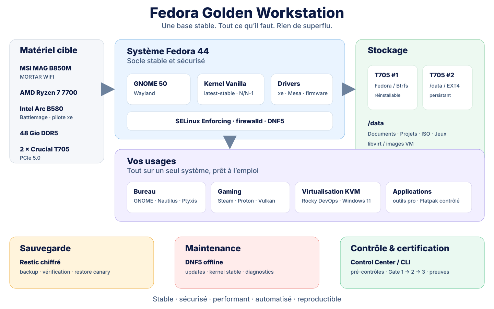
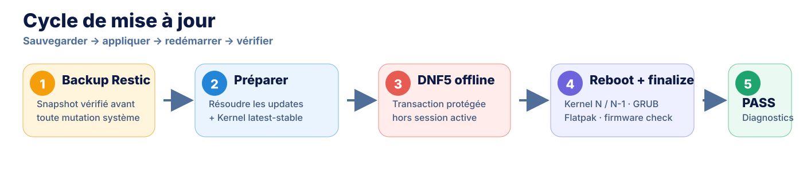
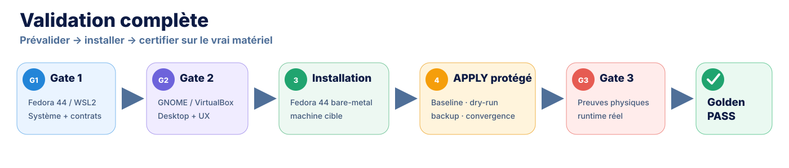

<div align="center">


# Fedora 44 Golden Workstation

**Production-oriented · Reproductible · Récupérable · CI-gated**

**Fedora 44 · GNOME 50 · Ryzen 7 7700 · Intel Arc B580 · DevOps · Gaming · KVM**

[](https://github.com/mathiasseguincadiche/FEDORA_GNOME_CUSTOM/actions/workflows/tests.yml)
[](https://github.com/mathiasseguincadiche/FEDORA_GNOME_CUSTOM/actions/workflows/shell-quality.yml)
[](https://github.com/mathiasseguincadiche/FEDORA_GNOME_CUSTOM/actions/workflows/fedora-package-preflight.yml)
[](https://github.com/mathiasseguincadiche/FEDORA_GNOME_CUSTOM/actions/workflows/fedora-gaming-pretest.yml)

**Golden Workstation 0.22.2**

Une Fedora Workstation traitée comme une **infrastructure versionnée** : installation contrôlée, stockage persistant, rollback, sauvegarde, diagnostic et certification.

**État logiciel : CODE-READY** · **Certification matérielle : Gate 3 bare-metal à exécuter**

</div>

> **Pourquoi ce projet existe, ses quatre piliers et les décisions du propriétaire : [docs/VISION.md](docs/VISION.md).** État : code prêt (CI verte), machine pas encore certifiée (Gate 2 puis Gate 3).
> Les sauvegardes utilisent Borg **sans chiffrement**, par décision du propriétaire (ADR 0014). Un PASS CI ne certifie pas le poste physique.
> La [fiche d'exécution physique](docs/PHYSICAL_QUALIFICATION_CHECKLIST.md) prépare les mesures sur le PC. La [qualification réseau Docker](docs/ROCKY_DEVOPS_READY.md#qualification-réseau-docker) couvre redémarrage/restauration ; les notices de maintenance EL10 restent visibles.

---

<p align="center">
  <a href="#démarrage-rapide">Démarrage</a> ·
  <a href="#architecture-globale">Architecture</a> ·
  <a href="#les-quatre-piliers">4 piliers</a> ·
  <a href="#matériel-cible">Matériel</a> ·
  <a href="#performance-fedora-linux">Performance</a> ·
  <a href="#finition-du-bureau-ubuntu-grade">Finition</a> ·
  <a href="#gaming">Gaming</a> ·
  <a href="#virtualisation">KVM</a> ·
  <a href="#sauvegarde-et-restauration">Backup</a> ·
  <a href="#mises-à-jour">Updates</a> ·
  <a href="#validation-complète--à-lire-avant-linstallation-de-production">Validation</a> ·
  <a href="#documentation">Docs</a>
</p>

## État du projet

| Contrôle | État |
|---|---|
| **Code / contrats** | `CODE-READY` |
| **CI de `main`** | 6 checks obligatoires avant fusion : `contracts`, `shellcheck`, `guards`, `packages`, `packages-and-integration`, `nautilus-ptyxis` |
| **Matériel cible** | MSI MAG B850M MORTAR WIFI · Ryzen 7 7700 · Arc B580 · 48 Gio · 2× Crucial T705 |
| **Certification physique** | **PENDING** — Gate 3 bare-metal |
| **Golden runtime-certified** | Non, tant que `gate3 certify` n'a pas réussi sur la machine cible |

**Suivi de fiabilité :** [corrections, preuves et parcours restant](docs/RELIABILITY_QUALIFICATION.md).

Les badges ci-dessus donnent l'état live des principaux workflows. La CI prouve les contrats logiciels ; **elle ne remplace jamais la preuve physique Gate 3**.

---

## Démarrage rapide

Le point d'entrée public est le **Workstation Control Center**.

```bash
git clone https://github.com/mathiasseguincadiche/FEDORA_GNOME_CUSTOM.git
cd FEDORA_GNOME_CUSTOM
./control.sh
```

Routes opérateur essentielles :

```bash
./control.sh status
./control.sh install dry-run
./control.sh update check
./control.sh backup now
./control.sh doctor all
./control.sh doctor gaming
./control.sh perf status
./control.sh kernel status
./control.sh cert status
```

<details>
<summary><strong>Aperçu du Control Center</strong></summary>

```text
══════════════════════════════════════════════════════════════════════════════════════
  FEDORA GOLDEN WORKSTATION — CENTRE DE CONTRÔLE
══════════════════════════════════════════════════════════════════════════════════════
  Projet      0.22.2      Fedora 44      Runtime BAREMETAL
  Kernel      <kernel actif>             N / N-1 · max 2
  GPU         Arc B580 / xe              Git      [CLEAN]
  Data        /data EXT4                 Gaming   [PASS]
  Performance [PASS] TuneD balanced
  Backup      [PASS]                     Certif.  [PENDING]
══════════════════════════════════════════════════════════════════════════════════════

  [1] Installation & convergence
  [2] Mises à jour
  [3] Sauvegarde & restauration
  [4] Diagnostics & santé
  [5] Kernel & boot
  [6] KVM / machines virtuelles
  [7] Performance Fedora Linux
  [8] Maintenance
  [9] Certification
  [10] Logs & preuves
```

</details>

`./menu.sh` reste un alias de compatibilité. Le détail de l'interface est dans [`docs/CONTROL_CENTER.md`](docs/CONTROL_CENTER.md).

> **Important :** ne lancer `install apply` qu'après préparation du matériel, de `/data`, de la baseline et du backup pré-APPLY. Les garde-fous restent actifs même lorsque l'opération est lancée depuis le menu.

---

## Architecture globale

<p align="center">
  
</p>

**En une phrase :** Fedora 44 constitue le HOST, `/data` porte la persistance, Gaming et KVM sont les workloads, Borg assure la résilience et les Gates prouvent l'état obtenu.

L'objectif n'est pas d'empiler des tweaks : le profil cherche une machine **stable, rapide, observable, réversible et reproductible**.

---

## Fedora 45 / GNOME 51

La transition est préparée par des profils versionnés, une CI Fedora 45 réelle et un parcours `plan → prepare → reboot → finalize`. Le profil Fedora 45 reste **pending** jusqu'à la vérification du média Workstation final signé, des extensions GNOME 51 et des preuves CI. Il est interdit de simplement changer les numéros des anciens verrous. Le profil actuel Fedora 44 / GNOME 50 reste la référence déjà testée pendant cette préparation.

```bash
./control.sh upgrade plan
bash scripts/development/release-readiness.sh --report-only
```

Voir [la migration et l'installation Fedora 45](docs/UPGRADE_FEDORA_45.md) pour les conditions de promotion, la sauvegarde des VM et la nouvelle qualification.

## Les quatre piliers

Le projet poursuit quatre objectifs **d'importance égale** ; aucun n'a le droit d'en casser un autre ([vision complète](docs/VISION.md)).

| Pilier | Ce qu'on veut | Guide d'entrée |
|---|---|---|
| **Finition GNOME façon Ubuntu** | Dock, bureau, tuilage, applications harmonisées, soin de l'écran QD-OLED | [`docs/GNOME.md`](docs/GNOME.md) |
| **Performance et réactivité** | Dernier noyau stable, réglages mesurés, aucun réglage aveugle | [`docs/PERFORMANCE.md`](docs/PERFORMANCE.md) |
| **Fiabilité et sauvegardes** | Dry-run, baseline et sauvegarde avant toute modification ; restauration prouvée | [`docs/CERTIFICATION.md`](docs/CERTIFICATION.md) · [`docs/BACKUP_RESTORE.md`](docs/BACKUP_RESTORE.md) |
| **Outils DevOps** | KVM isolé, labo Rocky Linux, terminal et Bash soignés | [`docs/KVM_QUICKSTART.md`](docs/KVM_QUICKSTART.md) |

### Le socle technique

| Couche | Contrat |
|---|---|
| **HOST** | Fedora Linux 44 Workstation · GNOME 50 · Wayland · SELinux Enforcing · firewalld |
| **Kernel & hardware** | Linux amont officiel, dernière stable vérifiée sur kernel.org · politique **N / N-1** · Arc B580 sur `xe` · hardware cible mesuré |
| **Données & recovery** | T705 système Btrfs · T705 `/data` EXT4 · Borg non chiffré (ADR 0014) · restauration staging-first |
| **Workloads** | Desktop GNOME · applications pro · Steam/Proton · bibliothèque `/data/Jeux` · QEMU/KVM/libvirt |
| **Opérations** | dry-run avant mutation · DNF5 offline · diagnostics · rollback kernel · firmware en consultation |
| **Preuves & gouvernance** | CI obligatoire · logs/reports/fingerprints · Gate 1/2/3 · Golden release manifest |

```text
valider → mesurer → sauvegarder → converger → qualifier → certifier → maintenir
```

---

## Matériel cible

| Élément | Cible |
|---|---|
| Carte mère | MSI MAG B850M MORTAR WIFI |
| CPU | AMD Ryzen 7 7700 |
| RAM | 48 Gio DDR5, validation 5600 puis 6000 MT/s |
| GPU | Intel Arc B580 `8086:e20b`, pilote `xe` |
| GPU PCIe | ReBAR actif, lien x8, capacité ≥ PCIe 4.0 |
| SSD système | Crucial T705, Btrfs non chiffré |
| SSD données | Crucial T705, EXT4 monté sur `/data` |
| NVMe PCIe | x4, capacité PCIe 5.0 |
| Écran | ASUS ROG Strix OLED XG27AQDMES, 2560×1440/~240 Hz |

Le profil d'affichage est lié à l'EDID réellement certifié sur un connecteur appartenant à la B580. L'iGPU Ryzen est **désactivé dans le BIOS** par décision du propriétaire : la B580 est le seul GPU.

---

## Stockage persistant

Le premier T705 contient le système. Le second protège les données de travail d'une réinstallation du disque système.

```text
Crucial T705 #1
└── Fedora 44 / Btrfs
    └── système, applications, HOME système

Crucial T705 #2
└── /data / EXT4
    ├── Documents/      → XDG Documents
    ├── Projets/        → travail / Git / DevOps
    ├── ISO/            → bibliothèque ISO
    ├── Jeux/           → bibliothèque Steam / jeux
    └── libvirt/        → images et données KVM
```

Le dépôt **ne formate jamais automatiquement le second T705**. Une réinstallation doit remonter `/data` et réutiliser son contenu existant.

`Documents` et `Projets` sont protégés par Borg. `ISO` et `Jeux` restent hors backup automatique par défaut pour éviter de dupliquer de gros payloads reproductibles.

---

## Kernel et boot

Le projet accepte uniquement le **noyau officiel Linux amont stable, sans patch de distribution ni noyau personnalisé**. Sa référence est `latest_stable` sur [kernel.org](https://www.kernel.org/), vérifiée à chaque installation et mise à jour ; les RC et linux-next sont refusés ([ADR 0015](docs/adr/0015-official-upstream-linux.md)).

Les RPM `@kernel-vanilla/stable` permettent de suivre Linux indépendamment du calendrier des mises à jour Fedora. La dépendance `@kernel-vanilla/fedora` fournit aussi des noyaux amont sans patch. Une version RPM en retard sur kernel.org bloque l'installation : elle n'est jamais présentée comme « dernière stable ». Les [sources officielles signées](docs/UPSTREAM_LINUX.md) peuvent être récupérées immédiatement ; ce téléchargement ne compile ni n'installe un noyau.

```text
N   = dernière stable officielle effectivement installée, défaut GRUB
N-1 = version installée immédiatement précédente, conservée pour revenir en arrière
max = 2 versions kernel-core ; aucun second canal ni secours supplémentaire épinglé
```

Lors du premier passage, le noyau Fedora déjà démarré peut servir de N-1. Après une deuxième mise à jour amont, N et N-1 sont tous deux amont. DNF protège le noyau en cours d'exécution : si cela empêche la rétention à deux versions, il faut démarrer sur N puis relancer la purge. Secure Boot actif ou indéterminé bloque l'installation ; aucune protection n'est désactivée automatiquement.

Commandes ciblées :

```bash
./diagnostics/kernel-doctor
./control.sh kernel install-latest
./control.sh kernel prune
./control.sh kernel rollback
./control.sh kernel rollback-fedora   # récupération d'urgence uniquement
```

---

## Performance Fedora Linux

La Golden Workstation ajoute une couche de performance **mesurée, réversible et Fedora-native** :

- AMD P-State/EPP observé et qualifié sur le Ryzen 7 7700 ;
- TuneD/tuned-ppd comme pont avec les profils d'alimentation GNOME ;
- `sched_ext`/SCX disponible en mode `auto`, mais jamais activé globalement sans smoke test bare-metal ;
- zram conservé sur les defaults Fedora ;
- NVMe T705 en politique `benchmark-only`, sans ADIOS/APST/ASPM forcé ;
- GameMode dynamique par workload ;
- analyse de frametimes MangoHud p50/p95/p99/p99.9 pour les comparaisons A/B à 240 Hz.

```bash
./control.sh perf status
./control.sh perf balanced
./control.sh perf performance
./control.sh perf sched-status
./control.sh perf sched-smoke
./control.sh perf zram
./control.sh perf nvme
```

Le contrat interdit les tweaks globaux non mesurés : pas de `sysctl -w` de performance, pas de `nohz_full`, pas de scheduler I/O expérimental imposé, pas d'overclock GPU automatique. La Gate 3 exige aussi le contrat performance Golden dans son état normal avant de produire un PASS final. Voir [`docs/PERFORMANCE.md`](docs/PERFORMANCE.md).

---

## Finition du bureau « Ubuntu-grade »

Fedora livre GNOME brut ; Ubuntu y ajoute une finition. Le module `gnome.polish` apporte **la même finition sur Fedora** ([`docs/GNOME_POLISH.md`](docs/GNOME_POLISH.md), [ADR 0013](docs/adr/0013-ubuntu-grade-gnome-polish.md)) :

- dock à gauche avec masquage intelligent pour l’écran OLED, clic = focus / réduire / aperçus ;
- session ouverte directement sur le bureau ;
- **Tiling Assistant** (l'« Enhanced Tiling » d'Ubuntu), épinglé par SHA-256 ;
- couleur d'accent, jour dans l'horloge, fenêtres centrées ;
- applications GTK3 au look libadwaita, qui suivent le mode clair/sombre.

```bash
./control.sh doctor polish
```

Tout est réglable dans `config/local.conf`, sans toucher au code.

---

## Intégration du bureau et des périphériques

GNOME Logiciels reste le catalogue d’applications ; ses mises à jour sont verrouillées pour conserver la sauvegarde préalable et la transaction système via `./control.sh update all`. Les Flatpak se mettent à jour explicitement avec `flatpak update`. Après APPLY, ouvrir une nouvelle session puis vérifier `diagnostics/lifecycle-doctor`.

GNOME Disques et Flatseal sont intégrés au catalogue. Le laboratoire Fedora 44 teste les six extensions actives et un aller-retour bureautique réel. Les contrôles de présence/sandbox ne remplacent pas les essais d’usage, de partage d’écran ou de webcam. Les identités audio de la carte mère et Brio 100 sont enrôlées séparément ; les capacités Wi-Fi déclarées obligatoires bloquent si elles ne sont pas prouvées.

L’afficheur DeepCool LD240 dispose d’une intégration **facultative**, communautaire et épinglée, inactive par défaut. Voir [le guide d’intégration et de qualification](docs/DESKTOP_COMPLETION.md). La qualification matérielle reste à exécuter sur le PC.

---

## Gaming

Gaming fait partie du **profil Golden canonique**.

Le socle couvre Steam RPM, Proton géré par Steam, Mesa/Vulkan x86_64+i686, GameMode, MangoHud, GOverlay, Gamescope, Steam Input et la bibliothèque persistante `/data/Jeux`.

Le projet conserve la pile graphique Fedora : pas de Mesa git/COPR, pas de `force_probe`, pas de Proton-GE imposé globalement. Le pilote `xe` vient du noyau Linux amont officiel ; Mesa/ANV restent fournis par Fedora.

```bash
./control.sh doctor gaming
```

La preuve finale reste bare-metal : rendu Vulkan Arc B580, Wayland, VRR/~240 Hz et lancement Steam/Proton. Voir [`docs/GAMING.md`](docs/GAMING.md).

---

## Accès distant

Profil **optionnel et désactivé par défaut** pour piloter le PC depuis une tablette : Tailscale (aucun port exposé), SSH par clés, Wake-on-LAN et, en option, Sunshine + Moonlight.

```bash
./control.sh remote status   # contrôle complet, lecture seule
./control.sh remote info     # MAC / diffusion LAN à reporter sur le relais de réveil
```

Le réveil d'un PC éteint exige un **relais toujours allumé** sur le LAN, et le Wake-on-LAN depuis un arrêt complet se **mesure** au Gate 3. Le guide analyse l'architecture demandée, ses limites et ses alternatives : [`docs/REMOTE_ACCESS.md`](docs/REMOTE_ACCESS.md) · [ADR 0017](docs/adr/0017-remote-access.md).

---

## Virtualisation

KVM/libvirt est isolé du profil Gaming et utilise le second T705.

```text
qemu:///system
└── pool devops-data → /data/libvirt/images

réseau devops-nat
└── virbr50 / 192.168.50.0/24
    ├── Internet autorisé
    ├── forwarding entrant refusé
    └── accès aux réseaux HOST protégés fail-closed
```

Profils prévus :

- **Rocky Linux 10.2 DevOps** — Q35, host-passthrough, VirtIO, cloud image authentifiée ;
- **Windows 11** — Q35, TPM 2.0, UEFI Secure Boot, VirtIO, QEMU Guest Agent.

```bash
./control.sh kvm status
./control.sh kvm create-rocky
./control.sh kvm create-windows
```

Voir [`docs/KVM_QUICKSTART.md`](docs/KVM_QUICKSTART.md) et [`docs/VIRTUALIZATION.md`](docs/VIRTUALIZATION.md).

---

## Mises à jour

La maintenance suit une chaîne protégée :

<p align="center">
  
</p>

```bash
./control.sh update all
./control.sh update status
./control.sh update reboot
# après le redémarrage
./control.sh update finalize
```

`finalize` vérifie le nouveau kernel, GRUB, `dnf5 check`, puis applique la rétention N/N-1. Aucun firmware n'est flashé automatiquement.

Si le dernier noyau stable n'est pas encore publié en paquet (ou si kernel.org est injoignable), **seul le noyau est reporté** : toutes les autres mises à jour, sécurité comprise, sont appliquées, et le bilan l'indique ([détails](docs/UPSTREAM_LINUX.md)).

---

## Sauvegarde et restauration

Borg fournit la deuxième couche de résilience :

```text
T705 système perdu
    → réinstallation Fedora
    → /data conservé

T705 données perdu
    → Borg externe (non chiffré, ADR 0014)
    → restauration staging-first
```

```bash
./control.sh backup now
./control.sh backup now-with-vms
./control.sh backup check
./control.sh backup deep
./control.sh backup restore latest
./control.sh backup dr-plan
```

Les images QCOW2 doivent être froides/arrêtées avant une sauvegarde VM cohérente. Une restauration ne remplace jamais silencieusement le système actif.

Voir [`docs/BACKUP_RESTORE.md`](docs/BACKUP_RESTORE.md).

---

## Sécurité et garde-fous

Les invariants principaux sont explicites :

- SELinux **Enforcing** ;
- firewalld actif ;
- Secure Boot **désactivé** par politique ;
- aucun LUKS/dm-crypt sur les disques locaux du HOST ;
- les sauvegardes Borg externes ne sont pas chiffrées non plus (ADR 0014) : le disque de sauvegarde se range comme un document sensible ;
- aucun formatage automatique du second T705 ;
- aucun flash firmware automatique ;
- aucun GPU passthrough de la B580 ;
- aucun `force_probe`, Mesa git ou dépôt GPU tiers ;
- réseau KVM fail-closed ;
- APPLY réel uniquement sur bare-metal, avec Git propre, baseline, dry-run et backup valides.

Lire [`SECURITY.md`](SECURITY.md) et [`docs/HOST_SECURITY_POLICY.md`](docs/HOST_SECURITY_POLICY.md) avant de modifier ces invariants.

---

## Documentation

Le README reste la **synthèse opérateur** ; les détails normatifs et runbooks vivent dans `docs/`.

| Besoin | Référence |
|---|---|
| Comprendre pourquoi | [`docs/VISION.md`](docs/VISION.md) · [`docs/CAHIER_DES_CHARGES.md`](docs/CAHIER_DES_CHARGES.md) |
| Installer | [`docs/INSTALLATION_GUIDE.md`](docs/INSTALLATION_GUIDE.md) · [`docs/HARDWARE_BASELINE_CERTIFICATION.md`](docs/HARDWARE_BASELINE_CERTIFICATION.md) |
| Piloter | [`docs/CONTROL_CENTER.md`](docs/CONTROL_CENTER.md) |
| Comprendre l'architecture | [`docs/GOLDEN_WORKSTATION.md`](docs/GOLDEN_WORKSTATION.md) · [`docs/adr/README.md`](docs/adr/README.md) |
| Performance / Linux amont | [`docs/PERFORMANCE.md`](docs/PERFORMANCE.md) · [`docs/UPSTREAM_LINUX.md`](docs/UPSTREAM_LINUX.md) |
| Bureau GNOME | [`docs/GNOME.md`](docs/GNOME.md) · [`docs/GNOME_POLISH.md`](docs/GNOME_POLISH.md) |
| Gaming | [`docs/GAMING.md`](docs/GAMING.md) |
| KVM | [`docs/KVM_QUICKSTART.md`](docs/KVM_QUICKSTART.md) · [`docs/VIRTUALIZATION.md`](docs/VIRTUALIZATION.md) |
| Backup / recovery | [`docs/BACKUP_RESTORE.md`](docs/BACKUP_RESTORE.md) |
| Dépanner | [`docs/TROUBLESHOOTING.md`](docs/TROUBLESHOOTING.md) |
| Certifier | [`docs/CERTIFICATION.md`](docs/CERTIFICATION.md) · [`docs/GATE2_GUIDE_PAS_A_PAS.md`](docs/GATE2_GUIDE_PAS_A_PAS.md) · [`docs/THREE_GATE_VALIDATION.md`](docs/THREE_GATE_VALIDATION.md) |
| Reproduire une release | [`docs/GOLDEN_RELEASE.md`](docs/GOLDEN_RELEASE.md) |
| Comprendre la CI | [`docs/CI_VALIDATION.md`](docs/CI_VALIDATION.md) |

Le portail complet se trouve dans [`docs/README.md`](docs/README.md).

La source de vérité reste :

```text
code + configuration + tests CI
            ↓
document normatif courant
            ↓
document historique / release note
```

---

## Contribuer

Les changements doivent préserver les garde-fous Golden et passer la CI avant fusion.

Lire [`CONTRIBUTING.md`](CONTRIBUTING.md) avant d'ouvrir une PR. Les bugs, problèmes de validation hardware et écarts documentaires disposent de templates dédiés dans GitHub Issues.

---

# Validation complète — à lire avant l'installation de production

La validation est volontairement placée en fin de README : elle **prouve** le projet, mais elle n'est pas son interface quotidienne.

> Gate 1 et Gate 2 sont des prévalidations avant installation de production. **Gate 3 est la certification de la vraie machine après installation/APPLY** ; il ne peut donc pas être déclaré PASS à l'avance.

<p align="center">
  
</p>

## Gate 1 — système / WSL2

```bash
./control.sh validate gate1 run
./control.sh validate gate1 status
./control.sh validate export 1 /chemin/export
```

La preuve est portable et porte `hardware_certification=DEFERRED`.

## Gate 2 — GNOME / VirtualBox

Importer la preuve Gate 1 puis exécuter :

```bash
./control.sh validate import /chemin/gate1-<commit>.json
./control.sh validate gate2 plan
./control.sh validate gate2 apply
./control.sh validate gate2 check
./control.sh validate gate2 sign
./control.sh validate export 2 /chemin/export
```

Gate 2 valide GNOME 50/Wayland, Nautilus, Ptyxis, extensions et contrôle visuel, sans déverrouiller l'APPLY bare-metal.

## Installation bare-metal

La procédure détaillée est dans [`docs/INSTALLATION_GUIDE.md`](docs/INSTALLATION_GUIDE.md). Le chemin normal est :

```text
média Fedora 44 vérifié
      ↓
second T705 /data préparé
      ↓
baseline hardware
      ↓
./control.sh install dry-run
      ↓
./control.sh install backup
      ↓
./control.sh install apply
      ↓
reboot sur le dernier Linux amont stable N
```

## Gate 3 — certification physique

Importer les preuves Gate 1 puis Gate 2 sur le HOST :

```bash
./control.sh validate import /chemin/gate1-<commit>.json
./control.sh validate import /chemin/gate2-<commit>.json
./control.sh validate gate3 status
```

Produire ensuite les preuves physiques prévues par le runbook : GPU/Vulkan, LAN, Wi-Fi, audio, affichage VRR/HDR, KVM/Windows et cinq cycles veille/réveil. Les commandes détaillées sont documentées dans [`docs/THREE_GATE_VALIDATION.md`](docs/THREE_GATE_VALIDATION.md) et [`docs/GOLDEN_COMPLETENESS_CLOSURE.md`](docs/GOLDEN_COMPLETENESS_CLOSURE.md).

Après chaque vrai cycle suspend/resume :

```bash
./control.sh validate gate3 record-suspend
```

Certification finale :

```bash
./control.sh validate gate3 certify
```

Un PASS produit le marker Golden et [`golden-release.json`](docs/GOLDEN_RELEASE.md). Tant que cette commande n'a pas réussi sur le matériel cible, le dépôt est **code-ready**, mais la workstation physique n'est pas encore **Golden runtime-certified**.
